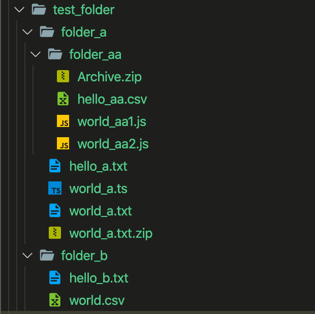

# AWS S3 bucket object folder Terraform module

Terraform module, which takes care of uploading a folder and its contents to a bucket. It also determines `content_type` of object automatically based on file extension.

It only uses the following AWS resource:

- [AWS S3 Bucket Object](https://www.terraform.io/docs/providers/aws/r/s3_bucket_object.html)

Supported features:

- Create AWS S3 object based on folder contents

## Terraform versions

Only Terraform 0.12 is supported.

## Usage



### For all the files of a folder

```hcl
module "test_aws_s3_folder_1" {
  source = "s3_object_folder"

  bucket                = "test_bucket"
  base_folder_path           = path.module # Or, something like "~/abc/xyz/build"
  file_glob_pattern     = "**"
  set_auto_content_type = true
}
```

### For all the files of a folder matching specific type of file-extensions

```hcl
module "test_aws_s3_folder_2" {
  source = "s3_object_folder"

  bucket                = "test_bucket"
  base_folder_path           = "~/abc/xyz/build"
  file_glob_pattern     = "**/*.{txt|gif}"
  set_auto_content_type = true
}
```

### For all the `js` files of a subfolder

```hcl
module "test_aws_s3_folder_3" {
  source = "s3_object_folder"

  bucket                = "test_bucket"
  base_folder_path           = "~/abc/xyz/build"
  file_glob_pattern     = "folder_a/**/*.js"
  set_auto_content_type = true
}
```

### Change prefix of the key of S3 object

```hcl
module "test_aws_s3_folder_4" {
  source = "s3_object_folder"

  bucket                = "test_bucket"
  base_folder_path           = "~/abc/xyz/build"
  file_glob_pattern     = "**/*.{txt|zip}"
  set_auto_content_type = true

  path_prefix = {
    remove = "folder_a/"
    add    = "folder_c/folder_d/"   # You can decide to keep it as an empty string
  }

}
```

### Override content-type

```hcl
module "test_aws_s3_folder_5" {
  source = "s3_object_folder"

  bucket                = "test_bucket"
  base_folder_path           = "~/abc/xyz/build"
  file_glob_pattern     = "**/*.{txt|zip}"
  set_auto_content_type = false
  content_type          = "text/whatever"
}
```

Go throuh the `examples` folder and `variable.tf` for more information on the usage.

## Examples:

- [Example 1](https://github.com/chandan-singh/terraform-aws-s3-object-folder/tree/master/examples/example_1) - Uploading folder and its contents to a bucket

<!-- BEGINNING OF PRE-COMMIT-TERRAFORM DOCS HOOK -->

## Requirements

| Name      | Version    |
| --------- | ---------- |
| terraform | ~> 0.12.26 |
| aws       | ~> 2.35    |

## Providers

| Name | Version |
| ---- | ------- |
| aws  | ~> 2.35 |

## Inputs

| Name                          | Description                                                                                                                                                                                                               | Type          | Default                   | Required |
| ----------------------------- | ------------------------------------------------------------------------------------------------------------------------------------------------------------------------------------------------------------------------- | ------------- | ------------------------- | :------: |
| acl                           | The canned ACL to apply. Defaults to private.                                                                                                                                                                             | `string`      | `"private"`               |    no    |
| base_folder_path              | Local folder path that to be scanned for uploading objects to bucket.                                                                                                                                                     | `string`      |                           |   yes    |
| bucket                        | Local folder path that to be scanned for uploading objects to bucket                                                                                                                                                      | `string`      |                           |   yes    |
| content_disposition           | Specifies presentational information for the object. Read w3c content_disposition for further information.                                                                                                                | `string`      | `null`                    |    no    |
| content_encoding              | Specifies what content encodings have been applied to the object and thus what decoding mechanisms must be applied to obtain the media-type referenced by the Content-Type header field.                                  | `string`      | `null`                    |    no    |
| content_language              | The language the content is in e.g. en-US or en-GB.                                                                                                                                                                       | `string`      | `null`                    |    no    |
| content_type                  | A standard MIME type describing the format of the object data, e.g. application/octet-stream. All Valid MIME Types are valid for this input. It will be overriden if `set_auto_content_type` is set                       | `string`      | `null`                    |    no    |
| file_glob_pattern             | Glob pattern for selecting the files from the folder                                                                                                                                                                      | `string`      | `"**"`                    |    no    |
| force_destroy                 | Allow the object to be deleted by removing any legal hold on any object version. Default is false. This value should be set to true only if the bucket has S3 object lock enabled.                                        | `bool`        | `false`                   |    no    |
| kms_key_id                    | Specifies the AWS KMS Key ARN to use for object encryption. This value is a fully qualified ARN of the KMS Key                                                                                                            | `string`      | `null`                    |    no    |
| metadata                      | A map of keys/values to provision metadata (will be automatically prefixed by `x-amz-meta-`                                                                                                                               | `map(string)` | `{}`                      |    no    |
| object_lock_legal_hold_status | The legal hold status that you want to apply to the specified object. Valid values are ON and OFF.                                                                                                                        | `string`      | `null`                    |    no    |
| module_depends_on             | Reference to the resource it depends on                                                                                                                                                                                   | `any`         | `null`                    |    no    |
| object_lock_legal_hold_status | The legal hold status that you want to apply to the specified object. Valid values are ON and OFF.                                                                                                                        | `string`      | `null`                    |    no    |
| object_lock_mode              | The object lock retention mode that you want to apply to this object. Valid values are GOVERNANCE and COMPLIANCE                                                                                                          | `string`      | `null`                    |    no    |
| object_lock_retain_until_date | The date and time, in RFC3339 format, when this object's object lock will expire.                                                                                                                                         | `string`      | `null`                    |    no    |
| path_prefix                   | A Map - value of `remove` key will remove the prefix from the paths identified after applying `file_glob_pattern` on `base_folder_path`. Value of `add` key will be added as prefix to paths which will act as object key | `map(string)` | `{ remove = "" add = ""}` |    no    |
| tags                          | A map of tags to assign to the object.                                                                                                                                                                                    | `map(string)` | `{}`                      |    no    |
| server_side_encryption        | Specifies server-side encryption of the object in S3.                                                                                                                                                                     | `string`      | `null`                    |    no    |
| source_prefix                 | Prefix to add before items found after applying glob pattern on `base_folder_path`. It will help terraform find location of `base_folder_path` for upload.                                                                | `string`      | `null`                    |    no    |
| storage_class                 | Specifies the desired Storage Class for the object. Can be either STANDARD, REDUCED_REDUNDANCY, ONEZONE_IA, INTELLIGENT_TIERING, GLACIER, DEEP_ARCHIVE, or STANDARD_IA, STANDARD,                                         | `string`      | `"STANDARD"`              |    no    |
| website_redirect              | Specifies a target URL for website redirect.                                                                                                                                                                              | `any`         | `null`                    |    no    |

## Outputs

| Name                              | Description                                                     |
| --------------------------------- | --------------------------------------------------------------- |
| this_s3_bucket_object_ids         | The list of id of objects.                                      |
| this_s3_bucket_object_etags       | The list of etag of objects.                                    |
| this_s3_bucket_object_version_ids | The list of version_id of objects.                              |
| this_s3_bucket_object_keys_ids    | The list of map containing id and aws s3 key of objects.region. |

<!-- END OF PRE-COMMIT-TERRAFORM DOCS HOOK -->

## Authors

Module managed by [Chandan Singh](https://github.com/chandan-singh).

## License

MIT License. See LICENSE for full details.
